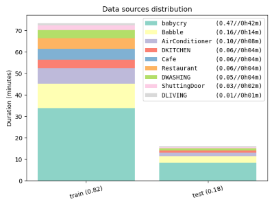

# Contents
| File Name | Description |
| --- | --- |
| build_dataset.sh         | shell script to build a train/test dataset from the included data corpus |
| DEMAND.zip               | DEMAND dataset, resampled to 16kHz |
| esc50-class-map.json     | ESC-50 class label to class-ID mapping |
| ESC50.zip                | ESC-50 dataset, resampled to 16kHz |
| MSSNSD.zip               | MS-SNSD dataset, resampled to 16kHz |
| requirements.txt         | python requirements file |
| split_into_segments.py   | helper script |
| split_into_train_test.py | helper script |
| source_youtube_video.sh  | Script to download audio from youtube |
| utils.py                 | common tools |

# What is this
This package includes 3 different open-source audio datasets that together can
be used for sound recognition tasks:

* DEMAND for different types of background noise
* MS-SNSD for additional types of background noise
* ESC-50 for different types of common sounds

In addition, included are some helper scripts to parse the data into fixed
length segments (`split_into_segments.py`) and to split the resultant segments
into balanced classes (`split_into_train_test.py`). 

The `build_dataset.sh` script ties all this stuff together to generate a dataset that
targets two or more classes. The final output will include the
following files:

| Name | Description |
| --- | --- |
| train/        | Folder containing all training .wav files |
| test/         | Folder containing all test .wav files |
| *_list.txt/   | Listing of .wav file paths for each fold |
| fold_distribution.png | Bar chart showing the makeup of the output dataset |

Note that the samples will be split into 2 or more classes:

1. The target classes (e.g. 'dog', 'glass_breaking', etc.)
2. Optionally, a class labeled 'noise'
3. Optionally, a class labeled 'unknown'

These samples can be directly uploaded to Edge Impulse, just make sure to correctly upload data as training or testing; *do not let Edge Impulse split the data for you*.
> *Note:* Each sample's class is given by the letters before the first period in the file name (e.g. noise.some-other-stuff.wav belongs to the 'noise' class). Edge impulse will infer the label from this file name format.

The output will also contain a bar chart which shows the makeup of the dataset among the training and testing folds as shown below.
|  |
| :--: |
| *Example fold distribution chart* |

# How to use this
1. Install the dependencies as specified in the section below.
2. Unzip the included datasets into the same output directory e.g.:
   > `for z in *.zip; do unzip $z; done`
3. Modify `build_dataset.sh` 
   1. Set `ESC50/DEMAND/YOUTUBE/MSSNSD_TARGETS` variables according to which
      categories/classes from the corresponding data corpus you'd like to
      include in your dataset.
   2. Set `NOISE/UNKNOWN/TARGET_CLASSES` variables according to the
      classes/categories from the data corpus you want to target for
      classification. The `NOISE` and `UNKNOWN` classes are optional and may be
      left blank.
   3. Set `SPLIT_SEGMENTS_ARGS` according to how you'd like to segment your
      data. This determines the length of each sample
      (`--segment-length=<fixed_length> OR <min_length>-[<max_length>]`), as
      well as whether to exclude segments below a certain signal level
      (`--silence-threshold`).
   4. Set `SPLIT_FOLDS_ARGS` according to how you'd like to split up your
      training and test data. This determines the portion of data that should be
      reserved for testing (`--test-ratio`), whether to balance samples among
      classes (`--balance-classes`), and other parameters.
4. Call `build_dataset.sh` with the source directory (where you've extracted the
   zip files) and output directory as arguments e.g.:
   > `./build_dataset.sh . my-dataset`
5. Upload the samples from the resultant `train/` and `test/` folders to your
   project.

> !NB! `split_into_train_test.py` depends on the convention that dataset
> folders are structured as `<data-set-name>_<category-name>` as is done in
> `build_dataset.sh`.

# Dependencies
* Python
  * Python 3.6 or greater is needed, and should be on your PATH.
  * To install python dependencies: 
    > `pip install -r requirements.txt`
* SoX
  * Install the latest SoX from
    https://sourceforge.net/projects/sox/files/latest/download or however else
    you get packages.
  * Included tools expect the SoX executable to be on your PATH.
* Unix like environment
  * For Windows, use Git Bash; for Linux or MacOS things should work out of the
    box.

# Sourcing Videos from Youtube
The included `source_youtube_video.sh` can be used to download audio from
youtube videos and convert to <=1 hour long chunks of 16kHz mono .wav audio files.

To add data to the `build_dataset.sh` workflow, use the below call convention:

> `./source_youtube_video.sh <youtube-vid> YOUTUBE/<class-label>`

This script has the following dependencies:
* [ffmpeg](https://ffmpeg.org/download.html)
* [youtube-dl](http://ytdl-org.github.io/youtube-dl/download.html)
* [faac](http://faac.sourceforge.net/)
* [SoX](https://sourceforge.net/projects/sox/files/latest/download)

# Pitfalls and Caveats
* If you want to add another data corpus to this workflow, you will have to
  modify `build_dataset.sh` and stick to the conventions used there.
* Special care needs to be taken when splitting data into training and testing folds:

    * If your training and testing data are too similar, your accuracy will look great but your model will not generalize well
    * If your training and testing data are too dissimilar your model will never be able to achieve good accuracy on your test data
    * [This article](https://towardsdatascience.com/train-validation-and-test-sets-72cb40cba9e7) covers some general points about how data should be split into folds.
  
  The `split_into_train_test.py` script does some work to help in this regard,
  but it's worth looking at that script to see how this is being done. You'll
  need to do something similar if you add your own data corpus.

* Adding to the above note, Edge Impulse doesn't explicitly allow labeling data
  as validation (data that is not directly 'learned' on, but is used to know
  when to stop training your model) and instead just shuffles data randomly. We
  can hack around this if it's causing a lot of issues.

# Data Sources
ESC-50
https://github.com/karolpiczak/ESC-50

DEMAND
https://zenodo.org/record/1227121#.XRKKxYhKiUk

MS-SNSD
https://github.com/microsoft/MS-SNSD